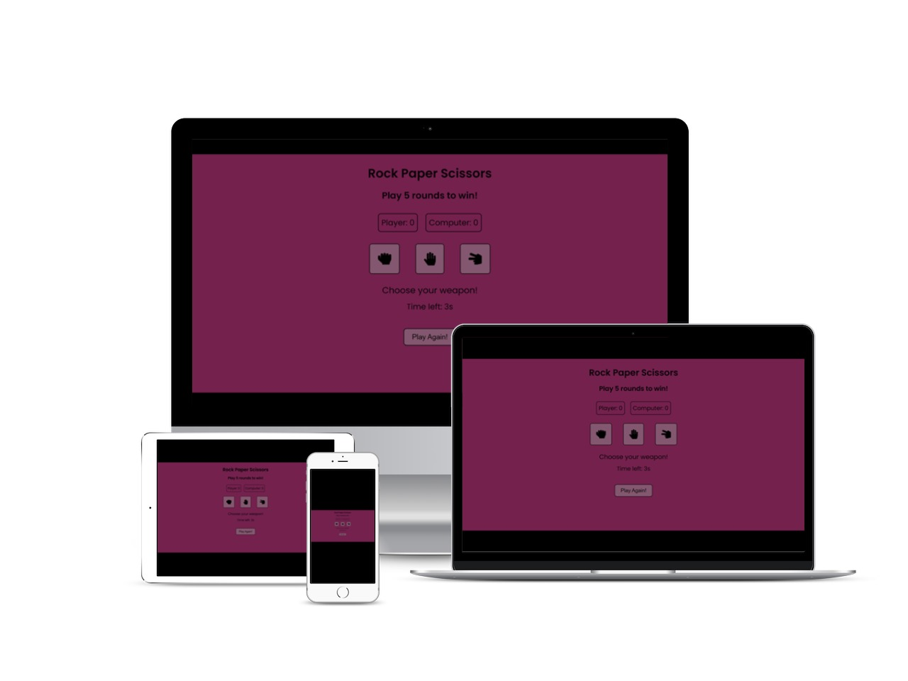
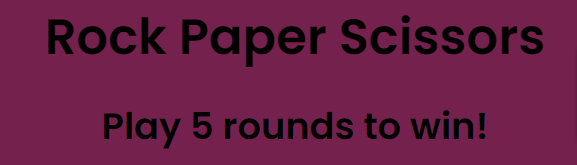
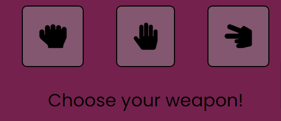
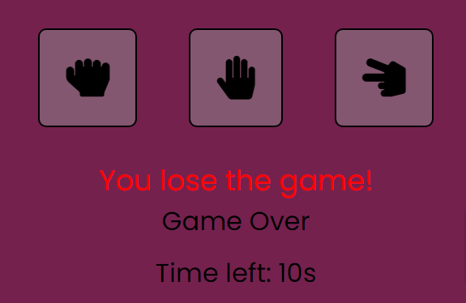
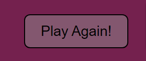
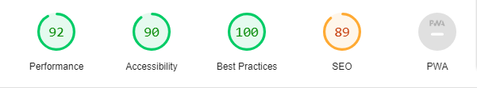
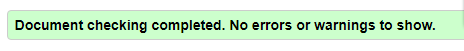
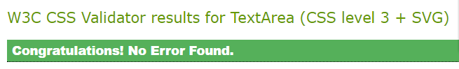

# Rock Paper Scissors 

Rock Paper Scissors is intrasitive hand game, usually played between two people, in which each player simultaneously forms one of three shapes with an outstretched hand. As the computer player in Rock Paper Scissors chooses randomly, the results of the game give a fairer result than playing with ones hands.

Users of this game will learn the rules of Rock Paper Scissors so they can make better and faster decisions in life. This game is targeted towards anyone (adults and children) as a simple app to learn, practice and have fun. 

## Features

- Header
 
  - Featured at the top of the page, the header shows the game name: Rock Paper Scissors in a font that is nice and pleasent for the eyes and in contrast with the background.
  - In the header is also a rule which tells the user that the game consists of five rounds before somebody is a winner.

- The Game Options

  - The Game options include a clear instruction and then a choice of options to choose from to play: Rock, Paper or Scissors. These options are interactive buttons that the user can click to make their choice.
  - This section provides interactive buttons that the user can click to make their choice and play the game. 

- The Game Results 

  - When the user clicks an option, the image expands relating to their choice so can clearly see what option has been chosen.
  - The JavaScript code chooses a random option for the Computer player, displaying the message below choices, for which option the computer has decided.
  - The winner is announced under the choices and the score is updated for either the user or the computer, depending on who won.
  - This section also contains a timer of 10 seconds giving the user enough time to make a choice before time ends, which makes the game more exciting.
  - The results and score are clear to the user, making the game easy to play, understand who won and what the score is.

- Footer

  - The Footer section shows the restart button so the user can try and beat computer again or just simply have another round of fun.

## Testing 

- I tested playing the game in different browsers: Chrome, Firefox, Safari, Bing, Opera
- I confirmed that the game results are always correct
- I confirmed that the header, instructions, options, results and footer text are all readable and easy to understand
- I confirmed that the chosen colors and fonts are easy to read and accessible by running it through lighthouse in DevTools

## Unfixed bugs

No unfixed bugs

## Validator testing

- HTML

  - No errors were returned when passing through the official W3C validator

- CSS

  -No errors were found when passing through the official (Jigsaw) validator

## Deployment 

- The site was deployed to GitHub pages. The steps to deploy are as follows:

  - In the GitHub repository, navigate to the Setting tab
  - Under Code and automation, scroll down to the Pages index
  - On Pages page, choose from the Source section, clicking on drop down menu select the Main Branch and click save
  - After few minutes the page will provide the link to the completed website

The live link can be found here - [Rock Paper Scissors](drmarija.github.io/rock-paper-scissors/)

## Credits 

### Media

- The images for hands are icons used from [Font Awesome](https://fontawesome.com/)

### Content

- [Coding Institute](https://codeinstitute.net)
- [Lauren-Nicole](https://github.com/CluelessBiker) - mentor
- [Faraz](https://codewithfaraz.com) - educational site
- [Sebhastian](https://sebhastian.com) - information site
- [Coding Wizards](https://www.codewizardshq.com) - site to easy understand JavaScript functions
